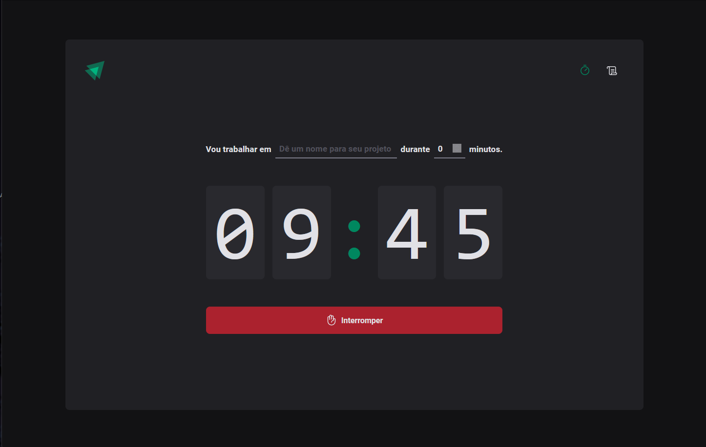
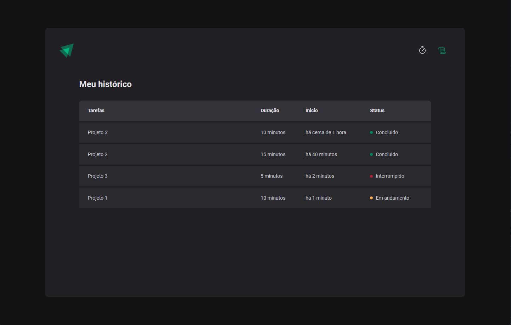

<p align="center">
  

  
 
  <a href="https://github.com/mbrenodev/Ignite-timer/commits/master">
    
  </a>
    
   
   <a href="https://github.com/mbrenodev/Ignite-timer/stargazers">
    
  </a>

  <a href="https://mbreno-ignite-timer.netlify.app/">
    
  </a>
</p>

<h1 align="center">
    
</h1>

<p align="center">
  <a href="#about">About</a> •
  <a href="#features">Features</a> •
  <a href="#how-it-works">How it works</a> • 
  <a href="#tech-stack">Tech Stack</a> • 
  <a href="#author">Author</a> • 
  <a href="#user-content-license">License</a>
</p>

<div align="center"> 
	
</div>

<div align="center"> 
	
</div>

## About

⏳ ignite-timer - Counter to use with Pomodoro technique.

Project developed during the ReactJS Ignite Course from [Rocketseat](https://www.rocketseat.com.br/ignite).

---

## Features

- [x] Create a timer
- [x] Interrupt timer
- [x] Log timer history
- [x] Persist data in local storage

---

## How it works

### Pre-requisites

Before you begin, you will need to have the following tools installed on your machine:
[Git](https://git-scm.com), [Node.js](https://nodejs.org/en/).
In addition, it is good to have an editor to work with the code like [VSCode](https://code.visualstudio.com/)

#### Running the web application (Frontend)

```bash

# Clone this repository
$ git clone git@github.com:mbrenodev/Ignite-timer.git

# Access the project folder in your terminal
$ cd Ignite-timer

# Install the dependencies
$ npm install

# Run the application in development mode
$ npm run dev

# The app will open on the port: 5173 - go to http://localhost:5173/

```

---

## Tech Stack

The following tools were used in the construction of the project:

#### **Website**  ([React](https://reactjs.org/)  +  [TypeScript](https://www.typescriptlang.org/))

- **[PhosphorIcons](https://phosphoricons.com/)**
- **[date-fns](https://date-fns.org/)**
- **[Vite](https://vitejs.dev/)**
- **[React Router](https://v5.reactrouter.com/web/guides/quick-start)**
- **[Immer](https://immerjs.github.io/immer/)**
- **[Styled Components](https://styled-components.com/)**
- **[Zod](https://zod.dev/)**
- **[React Hook Form](https://react-hook-form.com/)**

---
## Author

<a href="https://www.facebook.com/mbrenocardoso/">
 
 <br />
  
 <sub><b>Márcio Breno</b></sub></a> <a href="https://www.facebook.com/mbrenocardoso/" title="facebook"></a>
 <br />

[](https://www.linkedin.com/in/mbrenodev/) 
[](mailto:mbreno.dev@gmail.com)

---

## License

This project is under the license [MIT](./LICENSE).

---
